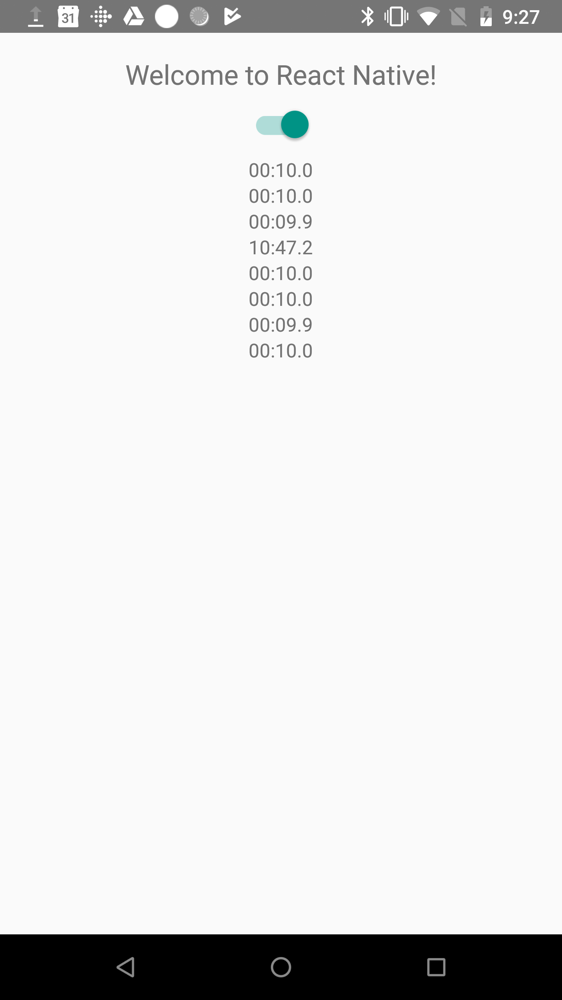

This is a React Native Foreground Service example app.  The `react-native init` [command](https://facebook.github.io/react-native/docs/getting-started.html) was used to create the initial project and the [react-native-create-library](https://github.com/frostney/react-native-create-library) tool was used as a start for the foreground service.

I wrote this example because I'd like to run a background timer at a regular interval and a Foreground Service sounds like the correct approach for Android. On further [reading](https://react-native.canny.io/feature-requests/p/background-timer-execution) it sounds like this will not work afterall.

Another approach would be to setup a native timer using the Android AlarmManager and on every interval send an event to JS as described [here](https://facebook.github.io/react-native/docs/native-modules-android.html#sending-events-to-javascript).

Some have suggested [react-native-background-timer](https://www.npmjs.com/package/react-native-background-timer) or [react-native-background-job](https://github.com/vikeri/react-native-background-job) but these have other limitations. The react-native-background-job package tried using a Foreground Service and found it to be [unstable](https://github.com/vikeri/react-native-background-job/issues/39) so it was removed from the 2.x version.

On the official React Native [pain points site](https://react-native.canny.io), Anthony Benkhebbab [suggests](https://react-native.canny.io/feature-requests/p/background-timer-execution) that running a Foreground Service using Android API > 23 will work but I have not found this to be the case.

## Main Component

The app starts a loop that runs every 10 seconds and displays the elapsed time (should be 10 seconds). The loop pushes a timestamp into the Redux store which is read and displayed by the main component. There's a switch at the top of the screen to enable/disable the foreground service. You'll see the Android Foreground Service notification confirming that it is running.

Based on [posts](https://github.com/Polidea/react-native-ble-plx/issues/217) regarding Foreground Services, I would expect the 10 second timestamps to be posted to the component even when the app is not in focus but I have not found this to be the case. Whether the foreground service is running or not, when you switch away from the app, the 10 second updates stop.

## Try it Out!

```
git clone https://github.com/rgstephens/RNForegroundExample.git
yarn
npm start
react-native run-android
```


